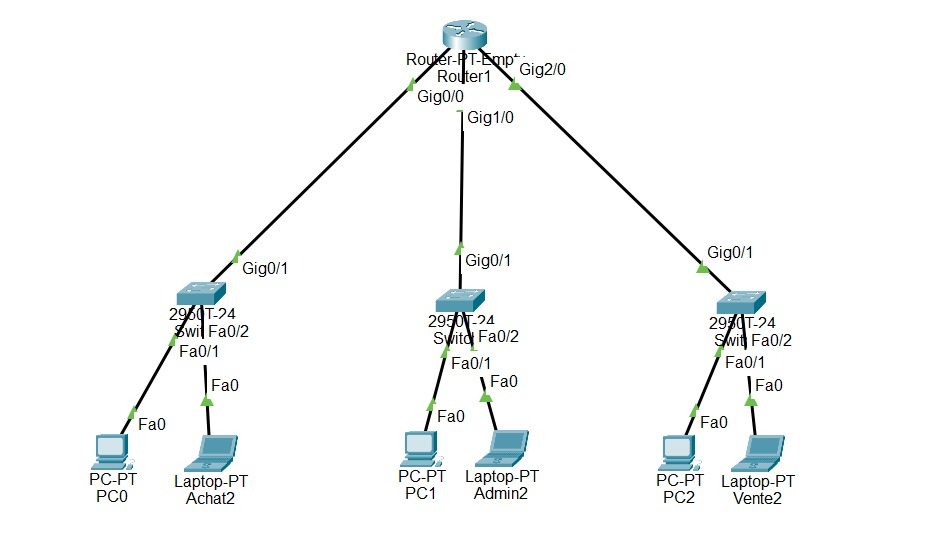

# Cisco Enterprise Network Lab

## Project Overview

This project demonstrates the design and implementation of a small enterprise network using Cisco Packet Tracer.

The network is divided into three departments:
- Purchasing (Achat)
- Administration (Admin)
- Sales (Vente)

The main objectives are to configure IPv4 addressing, subnetting, Cisco routers and switches, and validate connectivity between different subnets.

## Network Topology

  
The topology consists of:
- 1 Cisco Router-PT-Empty with 3 Gigabit Ethernet modules
- 3 Cisco 2950T-24 switches
- 3 PCs and 3 laptops
- Copper Straight-Through Ethernet cables

Each department has its own /26 subnet connected to a dedicated router interface.

## IP Addressing Table

**Base network:** `192.168.0.0/24`  
**Subnet mask:** `255.255.255.192 (/26)`  
**Usable hosts per subnet:** 62

| Device | IP Address | Subnet | Default Gateway |
|---|---|---|---|
| Achat Switch | 192.168.0.1 | /26 | 192.168.0.62 |
| Achat1 | 192.168.0.2 | /26 | 192.168.0.62 |
| Achat2 | 192.168.0.3 | /26 | 192.168.0.62 |
| Admin Switch | 192.168.0.65 | /26 | 192.168.0.126 |
| Admin1 | 192.168.0.66 | /26 | 192.168.0.126 |
| Admin2 | 192.168.0.67 | /26 | 192.168.0.126 |
| Vente Switch | 192.168.0.129 | /26 | 192.168.0.190 |
| Vente1 | 192.168.0.130 | /26 | 192.168.0.190 |
| Vente2 | 192.168.0.131 | /26 | 192.168.0.190 |

## Router Configuration

| Interface | Department | IPv4 Address |
|---|---|---|
| GigabitEthernet0/0 | Achat | 192.168.0.62/26 |
| GigabitEthernet1/0 | Admin | 192.168.0.126/26 |
| GigabitEthernet2/0 | Vente | 192.168.0.190/26 |

All three router interfaces are operational (`up/up`).

The router provides connectivity between the three directly connected networks.

## Network Configuration

The lab includes:
- IPv4 subnetting and addressing
- Router interface configuration
- Switch management IP addresses on VLAN 1
- Default gateway configuration
- Basic device access configuration
- Inter-subnet routing

## Connectivity Tests

Tests performed from Achat1:

| Destination | Expected Result | Observed Result |
|---|---|---|
| Achat gateway (192.168.0.62) | Reachable | PASS |
| Achat2 (192.168.0.3) | Reachable | PASS |
| Admin1 (192.168.0.66) | Reachable | PASS |
| Vente1 (192.168.0.130) | Reachable | PASS |

The tests confirm local connectivity and communication between the three departments.

## Tools and Technologies

- Cisco Packet Tracer
- Cisco IOS CLI
- IPv4 and subnetting
- Ethernet switching
- IP routing
- ICMP (ping)

## Learning Outcomes

This lab strengthened my understanding of IPv4 subnetting, network device configuration, basic routing and network troubleshooting.

## Security Note

This is an educational lab. The configuration uses demonstration credentials and is not hardened for production deployment.

## Download Project

[Download Cisco Packet Tracer Lab](packet-tracer/enterprise-network.pkt)
  
